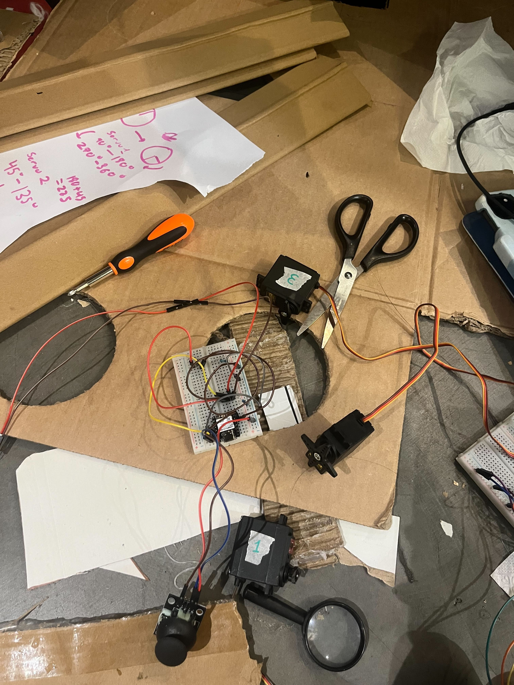
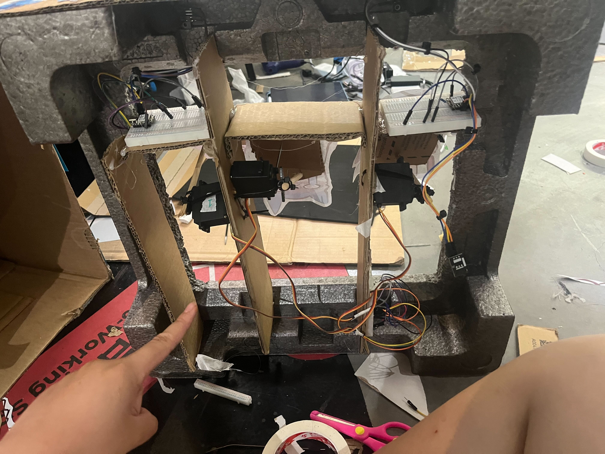

# Shoot That Soup

When the world is ending, where can we release all our struggles, anger out on? Our team koiterers believes to have found an answer: Shoot The Soup.

## Overview of How It Works
Shoot that Soup is a hardware game with an infared reciever and transmitter that allows the human to shoot the Soups that pop up and down. Aim the gun at the soup and shoot it down!! Only then you'll be able to find your inner peace <3 

## Key Parts Used:
- Seed studio XIAO ESP-32C3
- ESP32-WROOM-S3
- Joystick
- MG996R and MG995R servo motors
- IR reciver module and LED
- IR transmitter 
- Lots of cardboard 
- 
## Wiring
All of the wiring on this project is done through breadboards which are mounted throughout the case, these act like power hubs to distribute power to the rest of the components in the subsystem. 

Power is distributed by batteries and powerbanks hidden in the box!

The IR reciver breadboards for each of the soups are mounted on the bottom front of the stage so they can't be seen

Zipties were used to keep wires in order and to prevent them from getting tangled. Tape was also used to label each servo motor for organization purposes

## Firmware
# IR sensor firmware:
- The IR (Infared Radiation) reciver is programmed to listen to IR signals sent by the IR emitter module which is done by pressing a joystick. When the gun is aimed towards the direction of the reciver module, the reciver LED will light up indicating you hit that sound.

# Servo system firmware
The automated soups that move up and down are powered by 3 MG996R and MG995R servos (one for each soup). The firmware will randomly generate a number in which corresponds to a servo, once the servo is called it will lift the soup up. 

# Building Process

## How To Use It?
1. Pick up your soup shooter (gun)
    [insert photo of soup shooter]
2. Get ready, set your aim!
3. Fire away your frustrations against soup

## assembly instructions
1. Get your box (it is preferable if you soupify it)
2. Create a frame for your bottom stage, keep it simple with 2 collums!
3. Prep your breadboards with everything you need, this includes:
    - servo breadboards
    - a breadboard for each reciver
    - a breadboard for the gun

## Software Used
- Arduino IDE
- Wokwi
- Procreate
- CLAUDINA <33

